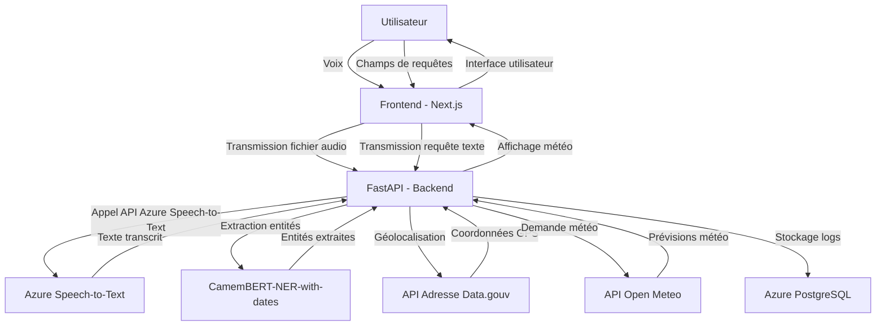

# Vocal Weather

## Description

**Vocal Weather** est une application permettant d'obtenir les prévisions météorologiques par reconnaissance vocale ou saisie textuelle. Son objectif est de faciliter l'accès aux informations météorologiques en permettant aux utilisateurs d'effectuer des demandes naturelles, que ce soit en parlant à l'application ou en tapant leur requête. 

L'application intègre des services d'intelligence artificielle pour la transcription vocale et l'extraction d'entités (dates et lieux). Elle fournit les prévisions via l'API d'Open Meteo et assure un suivi de l'utilisation grâce à un système de monitoring en base de données.

## Fonctionnalités

- Demande de météo par reconnaissance vocale
- Demande de météo via saisie textuelle
- Affichage des prévisions pour un lieu et une date donnés
- Gestion des demandes pour une date, une heure précise ou un intervalle de dates
- Monitoring des requêtes dans une base de données

## Technologies utilisées

- **Backend :** Python - FastAPI
- **Frontend :** Next.js - React
- **Base de données :** Azure PostgreSQL pour le monitoring

### Services externes intégrés

- **Azure Speech-to-Text :** Transcription des requêtes vocales en texte
- **CamemBERT-NER-with-dates :** Extraction des entités (dates, lieux) 
- **API d'adresse data.gouv :** Géolocalisation des lieux
- **API Open Meteo :** Récupération des prévisions météorologiques

## Installation (Développement)

### Prérequis

- [ffmpeg](https://ffmpeg.org/) doit être installé

### Configuration

1. **Fichier .env** : 
    
    Créer un fichier `.env` à la racine avec les variables suivantes :
    
    ```txt
    # Azure Speech-to-Text
    SPEECH_KEY=<Clé API>
    SPEECH_REGION=francecentral
    
    # Base de données
    DATABASE_URL="<URL de connexion>"
    ```
2. **Installation des dépendances :**
    
    pour l'api:
    ```bash
    python -m venv venv
    venv\Scripts\activate # ou source venv/bin/activate sous linux
    pip install -r requirements.txt
    ```

    pour l'application:
    ```bash
    cd frontend/vocal_weather
    npm install
    ```

### Lancement

1. **Démarrer l'API (Backend) :**
    
    ```bash
    fastapi run .\app\app.py
    ```
    
2. **Démarrer le Frontend :**
    
    ```bash
    cd frontend/vocal_weather
    npm run dev
    ```

## Utilisation (Utilisateur final)

Deux modes d'utilisation :

- **Demande vocale :** Cliquez sur le micro et énoncez une requête comme :
  - *"Quelle est la météo de demain à Paris ?"*
  - *"Donne-moi la météo pour dans 2 jours jusque dans 5 jours à Nantes."*
- **Saisie textuelle :** Entrez un lieu et une date/intervalle dans les champs prévus et cliquez sur "Chercher".

## Documentation technique

### Schéma fonctionnel



### Services d'IA

1. **Azure Speech-to-Text** : Transcription audio en texte.
2. **CamemBERT-NER-with-dates** : Extraction des entités nommées.

### Spécifications fonctionnelles

1. **Transcription vocale précise**
2. **Extraction des entités (dates, lieux)**
3. **Géolocalisation des lieux**
4. **Affichage des prévisions météo**
5. **Interface utilisateur intuitive**
6. **Monitoring des requêtes en base de données**

## Endpoints de l'API

### **POST /weather**

- **Entrée :**
  - Fichier audio (format WAV ou MP3)
- **Sortie (Succès) :**
  ```json
  {
    "current_weather": { "temperature_2m": 8.68, "relative_humidity_2m": 79, "apparent_temperature": 6.02, "precipitation": 0, "rain": 0, "weather_code": 3, "cloud_cover": 100, "wind_speed_10m": 4.32 },
    "weather_forecast": [ { "date": 1740877200000, "temperature": 1.96, "apparent_temperature": -3.19, "weather": 0, "wind_speed": 20.73, "cloud_cover": 20.73, "precipitation": 0, "rain": 0, "precipitation_probability": 0 } ],
    "location": { "latitude": 47.239367, "longitude": -1.555335, "city": "Nantes", "status": "success" }
  }
  ```
- **Sortie (Erreur) :**
  ```json
  { "error": "Pas de date(s) comprise(s)" }
  ```
- **Exemple d'appel :**
    ```bash
    curl -X POST -F "file=@audio.wav" http://localhost:8000/weather
    ```

### **POST /weather-from-text**

- **Entrée :**
  - Texte brut contenant la requête météo
- **Sortie :** Identique à `/weather`
- **Exemple :**
    ```bash
    curl -X POST -H "Content-Type: application/json" -d '"Quelle est la météo à Paris demain ?"' http://localhost:8000/weather-from-text
    ```

### **POST /weather-from-entities**

- **Entrée :**
  ```json
  {
    "dates": ["2025-03-02 19:00:00"],
    "location": "Tours"
  }
  ```
- **Sortie :** Identique à `/weather`
- **Exemple :**

    ```bash
    curl -X POST -H "Content-Type: application/json" -d '{"dates": ["2025-03-02 19:00:00"], "location": "Tours"}' http://localhost:8000/weather-from-entities
    ```

### Base de données

L'application utilise SQLAlchemy pour l'interaction avec la base de données PostgreSQL.
Modèle SQLAlchemy :

```python
class LogTable(Base):
        __tablename__ = 'log_table'
        id = Column(Integer, primary_key=True, autoincrement=True)
        timestamp = Column(String, nullable=False)
        code_stt = Column(Integer, nullable=False)
        error_message = Column(String, nullable=True)
        original_text = Column(String, nullable=False)
        db_connexion_time = Column(Integer, nullable=False)
        response_time_azure = Column(Integer, nullable=False)
        recognized_entities = Column(String, nullable=True)
        extraction_time_entities = Column(Integer, nullable=False)
        formatted_dates = Column(String, nullable=True)
        localisation = Column(String, nullable=True)
        weather_api_code = Column(Integer, nullable=False)
        weather_api_time = Column(Integer, nullable=False)
        weather_api_response = Column(String, nullable=True)
        weather = Column(String, nullable=True)
```

L'initialisation de la base de données se fait via SQLAlchemy, avec création automatique des tables si elles n'existent pas.
